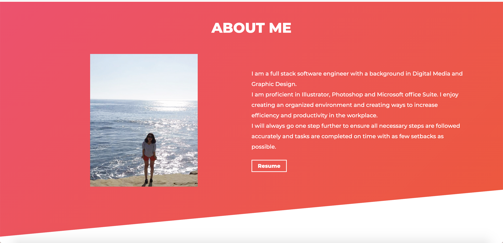
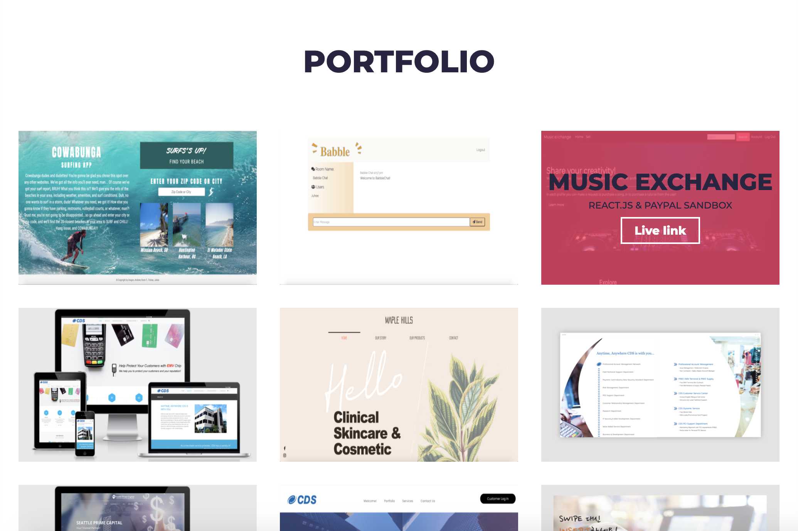
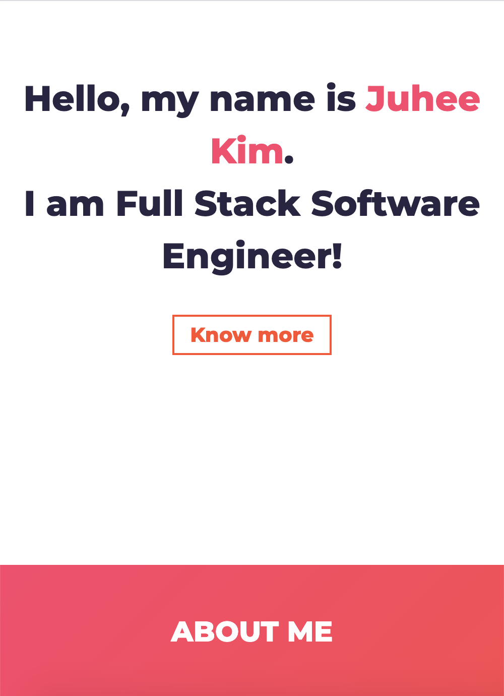

# Juhee Kim's React Portfolio
I am contents creator with a background in Digital Media, Graphic Design, Video, and Full Stack Development! I’ve created more than 300 websites by using Wordpress, Dreamweaver, AEM and other CMS tools. I also wanted to study more about full stack development and took the classes though UCLA Bootcamp. So, I have the knowledge and skills of HTML, CSS, JavaScript and so forth. I enjoy creating an organized environment and creating ways to increase efficiency and productivity in the workplace.

My portfolio site has the sites that I have built with html/css, Java Script, React, Wordpress, Wix, Duda and as well as the brochure, flyer, buisess cards that were created by using Adobe Illustrator and Photoshop. I have done more than portfolios and pretty sure that I will make more and better! 

## Link
Please visit [My Portfolio](http://iamjuhee.com/) site!

## Screenshots

## Built with
- [React](https://reactjs.org/)
- [npm](https://www.npmjs.com/)
- [React Bootstrap](https://react-bootstrap.github.io/)
- [Material UI](https://material-ui.com/)
- [SCSS](https://sass-lang.com/)
- [Google Fonts](https://fonts.google.com/)

